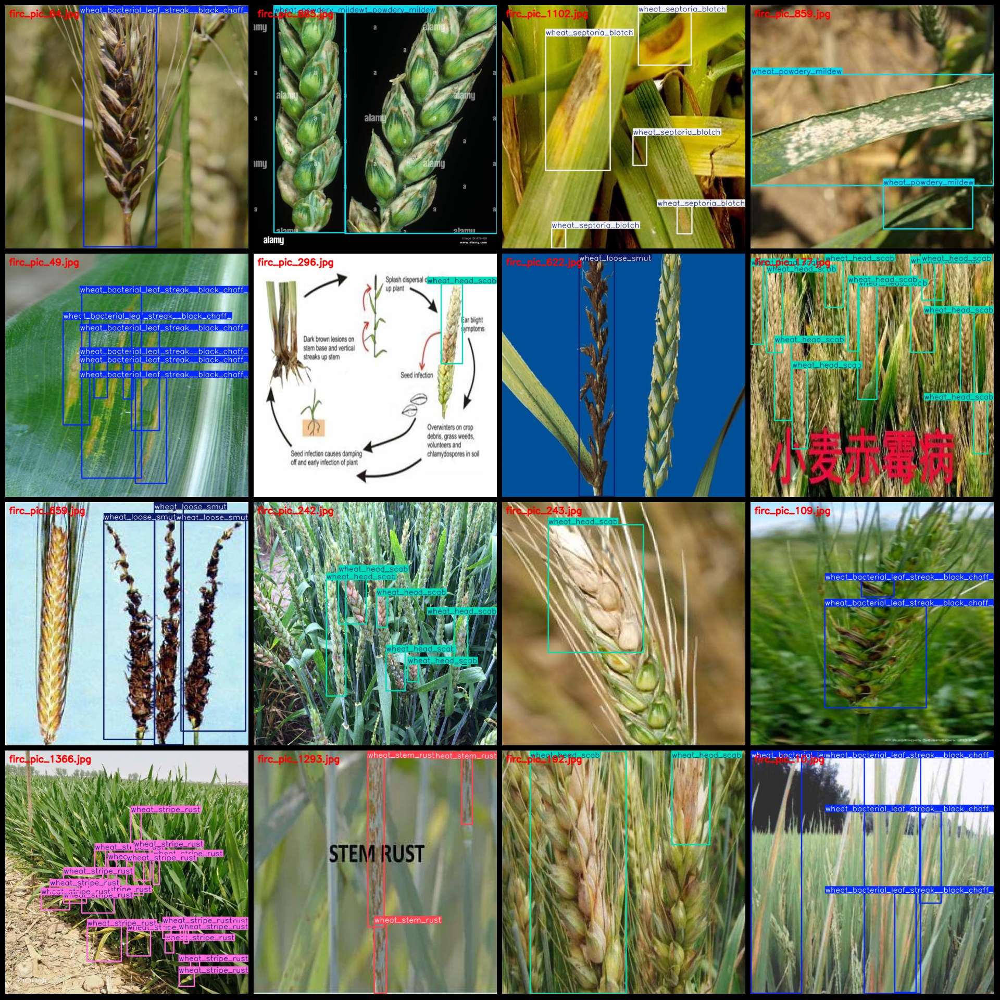
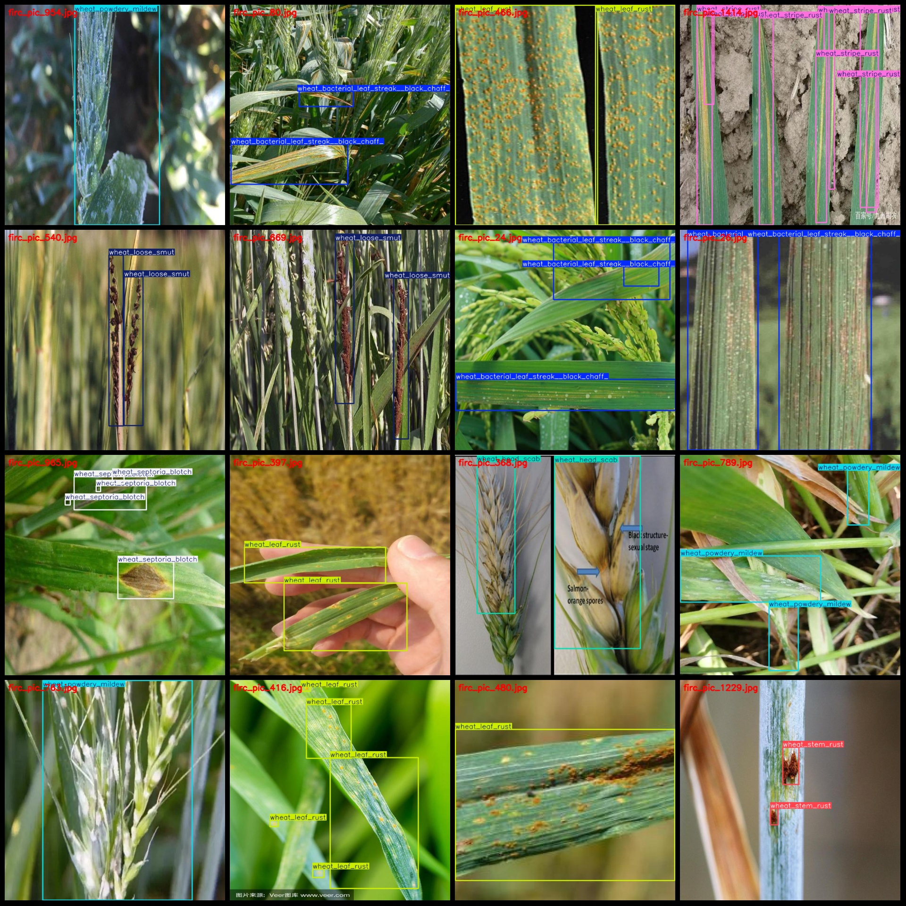

# Wheat Disease Detection Dataset: Pascal VOC+YOLO Format, 1618 Images in 8 Categories

Dataset Format: Pascal VOC format + YOLO format (excluding split paths in txt files, only containing jpg images and corresponding VOC format xml files and YOLO format txt files)
Number of Images (jpg file count): 1618
Number of Annotations (xml file count): 1618
Number of Annotations (txt file count): 1618
Number of Classes: 8
Classification Label Names (note that the order of labels in YOLO format does not correspond with this, but is based on the labels folder's classes.txt): ["wheat_bacterial_leaf_streak__black_chaff_", 
"wheat_head_scab", "wheat_leaf_rust", "wheat_loose_smut", "wheat_powdery_mildew", "wheat_septoria_blotch", "wheat_stem_rust", "wheat_stripe_rust"]
Number of Boxes per Classification:
- wheat_bacterial_leaf_streak__black_chaff_ (Wheat bacterial leaf streak/black chaff) boxes = 544
- wheat_head_scab (Wheat head scab) boxes = 976
- wheat_leaf_rust (Wheat leaf rust) boxes = 470
- wheat_loose_smut (Wheat loose smut) boxes = 434
- wheat_powdery_mildew (Wheat powdery mildew) boxes = 1006
- wheat_septoria_blotch (Wheat sheath blight) boxes = 971
- wheat_stem_rust (Wheat stem rust) boxes = 1072
- wheat_stripe_rust (Wheat stripe rust) boxes = 2084
Total number of boxes: 7557
Number of Images per Classification:
- wheat_bacterial_leaf_streak__black_chaff_ (Wheat bacterial leaf streak/black chaff) images = 111
- wheat_head_scab (Wheat head scab) images = 274
- wheat_leaf_rust (Wheat leaf rust) images = 128
- wheat_loose_smut (Wheat loose smut) images = 190
- wheat_powdery_mildew (Wheat powdery mildew) images = 256
- wheat_septoria_blotch (Wheat sheath blight) images = 199
- wheat_stem_rust (Wheat stem rust) images = 138
- wheat_stripe_rust (Wheat stripe rust) images = 322
Image Resolution: 640x640
Annotation Tool Used: labelImg
Annotation Rules: Drawing bounding boxes for each class
Important Notice: The dataset does not include partitioned training, validation, or test sets; users must divide them themselves.
Special Remark: This dataset does not guarantee the accuracy of models trained on it or the weights files.
Image Preview:

## Images

Here is a pay link on Stripe ( https://buy.stripe.com/3cs8yP7sY87d0vu9AB ). Please contact me lonlonago@foxmail.com after funding $89, and I will send you a complete data files , thank you!

